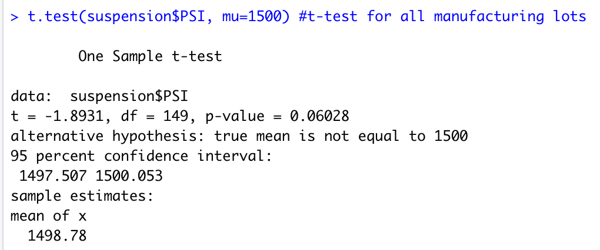
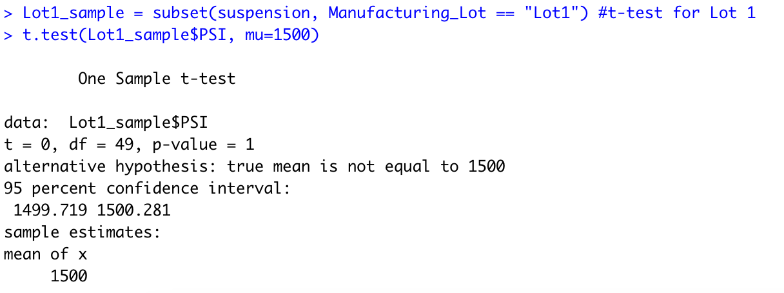
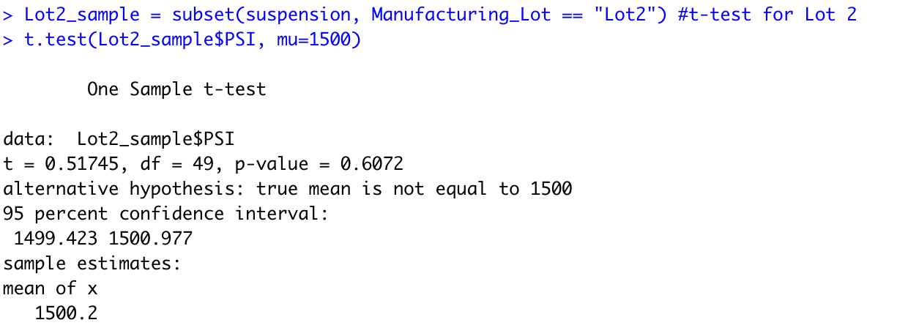
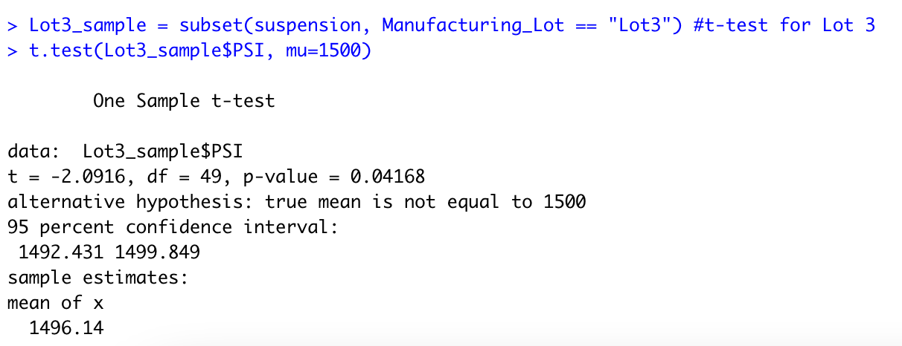

# MechaCar Statistical Analysis

## Linear Regression to Predict MPG
<b>1. Which variables/coefficients provided a non-random amount of variance to the mpg values in the dataset?</b>

Based on the statistical summary of the multiple linear regression model, the variables that most impact to the mpg values were vehicle length and ground clearance. Vehicle weight was close to a non-random result with a p-value of 0.08, but this is not nearly as sigificant compared to vehicle length and ground clearance.

<b>2. Is the slope of the linear model considered to be zero? Why or why not?</b>

The slope of the linear model is not considered to be zero (or a flat line) because the r-squared value of 0.71 suggests a positive correlation.

<b>3. Does this linear model predict mpg of MechaCar prototypes effectively? Why or why not?</b>

Since the r-squared value suggests a positive correlation and the p-value is significant, the linear model is a sufficient model of predicting the MPG of MechaCar prototypes. However, one thing to consider is that there are multiple variables that lack significance which could suggest overfitting. This means that our current model may not predict future data as well as we'd like.

## Summary Statistics on Suspension Coils
<b>The design specifications for the MechaCar suspension coils dictate that the variance of the suspension coils must not exceed 100 pounds per square inch. Does the current manufacturing data meet this design specification for all manufacturing lots in total and each lot individually? Why or why not?</b>
  
  For all manufacturing lots in total, the variance of the suspension coils is 62.29 pounds per square inch, and therefore meets the requirement of not exceeding 100 pounds per square inch. The total summary statistics can be viewed here:
  
  
  
  When viewing the data by each lot individually, Lot 1 and 2 are far under the 100 pound per square inch variance limit at 0.98 PSI and 7.47 PSI respectively. Lot 3 far exceeds the 100 pound per square inch variance limit at 170.29 PSI. Because the variance of Lot 3 is so much higher than the other lots, Lot 3 is contributing the most to the higher total average variance across all lots. The PSI variance by lot can be viewed here:
  
  
  
## T-Tests on Suspension Coils
<b>1. Is the PSI across all manufacturing lots statistically different from the population mean of 1500 pounds per square inch?</b>

Based on the p-value resulting from this t-test, the PSI across all manufacturing lots is just shy of being statistically significant from the population mean of 1500 PSI. The p-value for this test was 0.06 (compared to 0.05 benchmark). The mean of all manufacturing lots was 1498.78, while the population mean was 1500.

<b>2. Is the PSI for each individual manufacturing lot statistically different from the population mean of 1500 pounds per square inch?</b>

- <b>Lot 1:</b> The difference between the PSI for Lot 1 and the population mean PSI of 1500 is not statistically significant. In fact, the mean for Lot 1 is also 1500, which translates to a p-value of 1.

- <b>Lot 2:</b> The difference between the PSI for Lot 2 and the population mean PSI of 1500 is not statistically significant. The mean PSI for Lot 2 is 1500.2, while the population mean is 1500. This p-value for this t-test is 0.61.

- <b>Lot 3:</b> The difference between the PSI for Lot 4 and the population mean PSI of 1500 is statistically significant. The p-value from this t-test is 0.04, which is below the benchmark of 0.05. The mean PSI for Lot 3 is 1496.14.

## Study Design: MechaCar vs Competition
<b>To quantify how the MechaCar compares to its competition, a statistical study can be performed to compare the following metrics, which may be of interest to the consumer:</b>
- MPG highway/city
- cost
- electric/hybrid option
- crash safety rating

<b>For each of these metrics, the following hypotheses will apply:</b>
- MPG highway/city
  - Null hypothesis: There is no meaningful difference in average MPG highway/city between the MechaCar vs. the Competition
  - Alternative hypothesis: There is a statistically significant difference in the average MPG highway/city between the MechaCar vs. the Competition
- Cost
  - Null hypothesis: There is no meaningful difference in average MPG highway/city between the MechaCar vs. the Competition
  - Alternative hypothesis: There is a statistically significant difference in the average cost between the MechaCar vs. the Competition
- Electric/Hybrid option
  - Null hypothesis: There is no meaningful difference in the frequency of hybrid/electric options between the MechaCar vs. the Competition
  - Alternative hypothesis: There is a statistically significant difference in the frequency of hybrid/electric options between the MechaCar vs. the Competition
- Crash Safety Rating
  - Null hypothesis: There is no meaningful difference in the average crash safety rating between the MechaCar vs. the Competition
  - Alternative hypothesis: There is a statistically significant difference in the average crash safety rating between the MechaCar vs. the Competition

<b>To test these hypotheses, the following statistical tests will be conducted:</b>
- For the MPG highway/city, cost, and crash safety rating comparisons, a two-sample t-test would be the best option for completing the analysis
- For the electric/hybrid option comparison, a chi-squared test would be the best option for analyzing the difference in frequency

<b>Data requirements:</b>

To complete these analyses, a sample dataset of the Mecha Car and the Competition data for all metrics will be required. For this data to be utilized, the analyst should confirm the following:
- Each sample data was selected randomly from the population data
- Each sample size is reasonably large. Generally speaking, this means that the sample data distribution should be similar to its population data distribution

