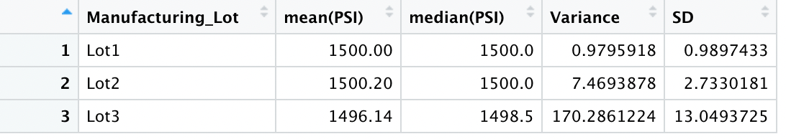

# MechaCar Statistical Analysis

## Linear Regression to Predict MPG
<b>1. Which variables/coefficients provided a non-random amount of variance to the mpg values in the dataset?</b>

Based on the statistical summary of the multiple linear regression model, the variables that most impact to the mpg values were vehicle length and ground clearance. Vehicle weight was close to a non-random result with a p-value of 0.08, but this is not nearly as sigificant compared to vehicle length and ground clearance.

<b>2. Is the slope of the linear model considered to be zero? Why or why not?</b>

The slope of the linear model is not considered to be zero (or a flat line) because the r-squared value of 0.71 suggests a positive correlation.

<b>3. Does this linear model predict mpg of MechaCar prototypes effectively? Why or why not?</b>

Since the r-squared value suggests a positive correlation and the p-value is significant, the linear model is a sufficient model of predicting the MPG of MechaCar prototypes. However, one thing to consider is that there are multiple variables that lack significance which could suggest overfitting. This means that our current model may not predict future data as well as we'd like.

## Summary Statistics on Suspension Coils
<b>The design specifications for the MechaCar suspension coils dictate that the variance of the suspension coils must not exceed 100 pounds per square inch. Does the current manufacturing data meet this design specification for all manufacturing lots in total and each lot individually? Why or why not?</b>
  
  For all manufacturing lots in total, the variance of the suspension coils is 62.29 pounds per square inch, and therefore meets the requirement of not exceeding 100 pounds per square inch. The total summary statistics can be viewed here:
  
  
  
  When viewing the data by each lot individually, Lot 1 and 2 are far under the 100 pound per square inch variance limit at 0.98 PSI and 7.47 PSI respectively. Lot 3 far exceeds the 100 pound per square inch variance limit at 170.29 PSI. Because the variance of Lot 3 is so much higher than the other lots, Lot 3 is contributing the most to the higher total average variance across all lots. The PSI variance by lot can be viewed here:
  
  
  
